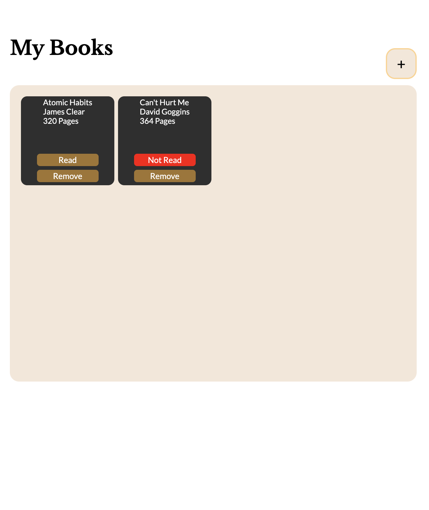
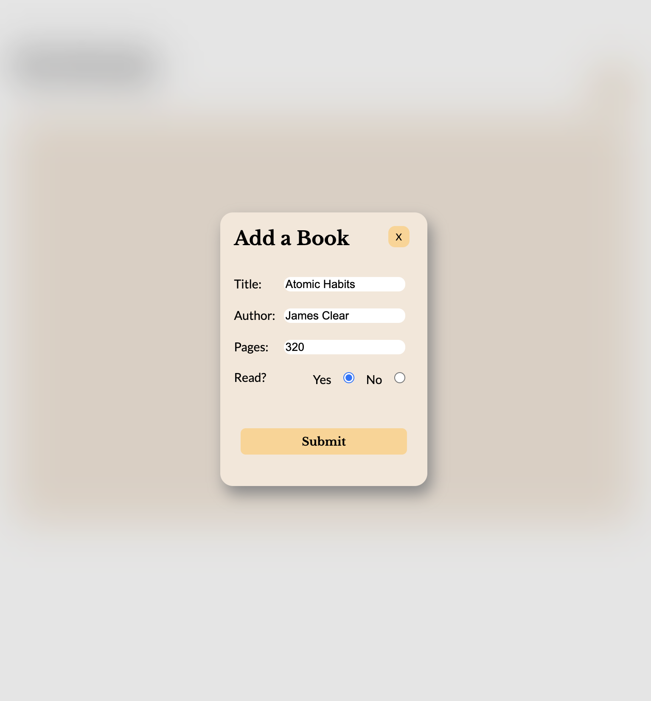

# library-app

## Project Goal:
- To create a simple Library App using an Object Constructor.

## Languages used:

-    
-    
- 

## Project Outcome:

## Future TODO:
- Style the individual book cards.
- Add ability to login in & store the library books.